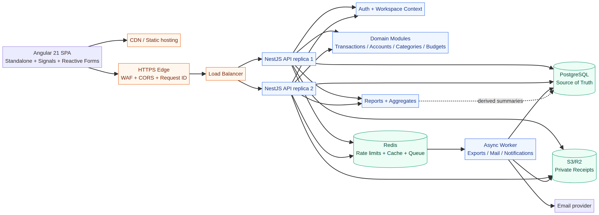
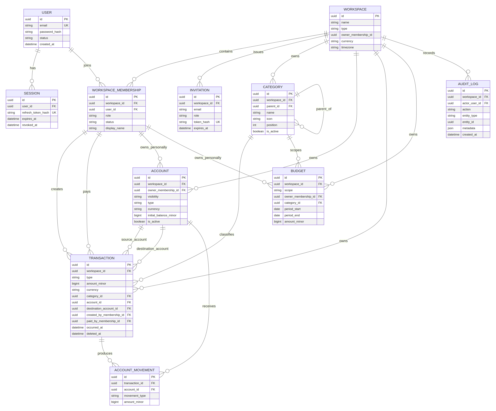
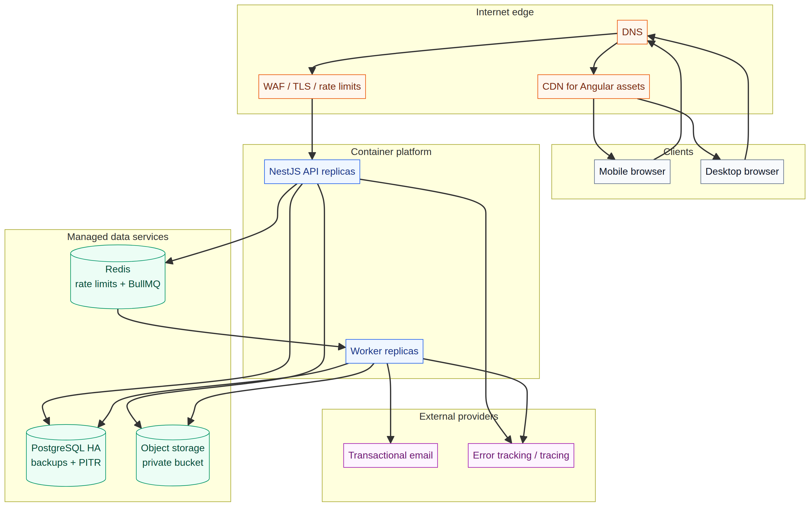

# FinTrack SaaS Architecture

**Author:** Manus AI  
**Status:** Architecture baseline for the MVP  
**Technology baseline:** Angular 21.2.x, NestJS 11.x, Node.js 22 LTS, PostgreSQL 16+, Prisma ORM, Redis 7.x  
**Last updated:** 13 August 2026

> **Implementation pin:** The delivered code pins Prisma ORM **6.19.2** with `engineType = "client"` and `@prisma/adapter-pg`. This is a deliberate compatibility choice for the current NestJS 11 CommonJS build while retaining the Rust-free PostgreSQL adapter path. The architecture remains compatible with Prisma 7, but a Prisma 7 upgrade should be handled as a separate ESM/configuration migration and must be validated in CI before changing the production baseline.

## Executive decision

This product should use a **generic `Workspace` tenant model from the first release**, not a `Family`-only root model. `Workspace` is the security and ownership boundary; it has a `type` of `PERSONAL` or `FAMILY` in the MVP. A personal workspace is automatically created at registration and has exactly one active member. A family workspace can contain multiple members with roles. The user-facing product language can continue to say “Family” wherever the workspace type is `FAMILY`.

This choice adds only a small number of columns and one clean naming abstraction now, while avoiding a disruptive tenant-root migration before supporting couples, roommates, or small businesses. It does **not** mean generic collaboration features or organizations must be built now. The MVP should enforce a small, explicit set of workspace types and roles, rather than speculative configurability.

| Decision | Recommendation | Rationale |
|---|---|---|
| Tenant boundary | `Workspace` with `PERSONAL` and `FAMILY` types | Supports personal and shared finances without later foreign-key migration. |
| Authorization source | Authenticated user + server-verified `WorkspaceMembership` | Prevents client-supplied tenant identifiers from acting as authority. |
| Financial model | A unified `Transaction` model with typed account movements | Simplifies reports and makes transfers first-class without double-counting. |
| Monetary storage | `amountMinor` as `BIGINT` plus ISO 4217 currency code | Avoids floating-point arithmetic and preserves exact values. |
| Balance source of truth | Immutable transaction/account movements; balance projection is derived/cacheable | Prevents drift caused by independently updating a mutable balance field. |
| Authorization model | Fixed workspace roles mapped to explicit server-side permissions | Is easy to audit and test; custom roles can be added later. |
| Deployment style | Stateless modular monolith | Keeps operational complexity proportionate while retaining extractable module boundaries. |

> **Security invariant:** A workspace identifier received in a route, body, query, header, or client state is only a *selector*. It becomes usable only after the API derives the authenticated user from the credential and verifies an active membership for that exact workspace. No repository query for tenant-owned data may execute without a server-derived workspace scope.

## 1. Product architecture

FinTrack is a shared-finance SaaS with two product modes. A **personal workspace** provides a private accounting space for one user, while a **family workspace** provides shared visibility and role-governed collaboration. The same transaction, account, category, budget, report, audit, and notification concepts are used in both modes, which preserves a coherent product and API.

The MVP’s principal financial record is a transaction. Transactions are owned by a workspace, have an accountable creator, and may name a different member as the payer. Expenses, income, and transfers share a common lifecycle and common query/filter interface. A transfer affects two accounts but is never included in income or expense totals. This avoids the reporting inconsistencies that commonly arise when transfers are modeled as two unrelated expenses/income rows.

| Domain | MVP responsibility | Explicit non-goal for MVP |
|---|---|---|
| Identity | Registration, verification, sessions, password recovery, device/session revocation | Social login and enterprise SSO |
| Tenant/workspace | Personal and family workspaces, membership, invitation, fixed roles | Arbitrary organization hierarchy |
| Finance | Accounts, categories, income, expenses, transfers, current-period dashboard | Bank synchronization, automatic categorization, receipt OCR |
| Planning | Category, personal, and shared monthly budgets | Recurring transaction engine and allocation/envelope accounting |
| Insight | Dashboard and server-side aggregate reports | Full data warehouse or real-time analytical streaming |
| Compliance | Audit trail, soft deletion, export-ready data model | Formal regulatory certification claims |

## 2. System architecture

The initial system is a stateless REST API backed by PostgreSQL and object storage, with Redis introduced only where it brings a concrete benefit. The frontend is deployable independently as static assets. The API is deliberately organized as a modular monolith: modules communicate through application services and domain events, not direct cross-module table access. This permits later extraction of notifications, exports, or reporting without prematurely operating microservices.



| Layer | Responsibility | Scale strategy |
|---|---|---|
| Angular application | Presentation, local UI state, routing, optimistic UI where safe, accessibility | CDN-hosted, immutable builds, horizontal scale by default |
| API edge | TLS termination, WAF, request size limits, CORS, rate limiting, request IDs | Load-balanced, stateless API replicas |
| NestJS application | Authentication, authorization, validation, business rules, audit events, REST/OpenAPI | Horizontal replicas; no in-process session or job state |
| PostgreSQL | Transactional source of truth, indexes, migrations, audit metadata | Managed HA service, read replicas only after measuring demand |
| Redis | Rate limits, short-lived auth state, cache, queue transport | Managed Redis with TTLs and bounded keys |
| Object storage | Private receipts and generated exports | Signed, scoped URLs; lifecycle policies; malware scan pipeline |
| Worker process | Asynchronous e-mail, export, receipt, notification, analytics jobs | Separate deployment from API; idempotent jobs |

The backend should use NestJS 11, which is the current stable major line at the time of this design, while NestJS 12 remains pre-release.[1] Angular 21 is a requested, viable LTS-pinned baseline; its new applications are zoneless by default and its current testing direction is Vitest.[2] Angular Signal Forms remains experimental in v21, so the MVP should use stable Reactive Forms while keeping signals for UI state and derived views.[2]

## 3. Workspace and tenant isolation

A workspace is the only tenant boundary. Every tenant-owned table must include a non-null `workspace_id`; that includes categories, accounts, transactions, budgets, audit rows, invitations, export requests, and future notification records. Tables that are global by nature—such as `users`, password-reset records, and sessions—do not carry a workspace identifier.

The API may expose routes such as `/api/workspaces/:workspaceId/transactions`. This is ergonomic but does not trust the route identifier. A `WorkspaceContextGuard` resolves the JWT/session user, loads an active membership for `(userId, workspaceId)`, attaches the resulting immutable context to the request, and rejects the request before a resource lookup occurs. Resource services additionally query on both `id` and `workspaceId`, so an ID copied from another workspace produces the same absence response rather than data disclosure.

| Control | Required implementation | Threat addressed |
|---|---|---|
| Tenant scope | Service receives server-created `WorkspaceContext`, never raw client workspace ID | Cross-tenant reads/updates |
| Resource lookup | `where: { id, workspaceId, deletedAt: null }` for every tenant resource | IDOR using guessed UUID |
| Membership lifecycle | `ACTIVE`, `INVITED`, `SUSPENDED`, `REMOVED` states | Access after revocation |
| Database constraints | Foreign keys plus composite unique/index constraints including `workspaceId` | Orphan and mismatched relations |
| Optional defense in depth | PostgreSQL RLS policy bound to transaction-local tenant setting | Missed application predicate |
| Tests | Two-tenant request suite for every resource family | Regression of isolation invariants |

PostgreSQL row-level security (RLS) is recommended as a **production hardening layer**, not a substitute for service-layer policy. Because connection pools reuse sessions, the tenant variable must be set with `SET LOCAL` inside each database transaction and must never use a process-global mutable value. Initially, the service layer and RLS should agree, with database credentials unable to bypass RLS in the production application role. If the operational team cannot safely guarantee transaction-scoped context through the chosen pooler, ship with application-layer isolation plus exhaustive authorization tests first and introduce RLS only after that boundary is verified.

## 4. Data model and ERD

The diagram below shows the normalized MVP model. `User` is global. `WorkspaceMembership` implements the many-to-many user/workspace relationship, carries the role, and provides the identity of a member within the workspace. Entities that refer to “created by,” “paid by,” or account ownership point to membership or user identity as appropriate; this prevents cross-workspace references.



### 4.1 Core entities

| Entity | Essential fields | Notes and constraints |
|---|---|---|
| `User` | `id`, `email`, `passwordHash`, `firstName`, `lastName`, `avatarUrl`, `status`, timestamps | Email is case-normalized and uniquely indexed. Never return `passwordHash`. |
| `Session` | `id`, `userId`, `refreshTokenHash`, `family`, `ipHash`, `userAgent`, `expiresAt`, `revokedAt` | One-time rotating refresh-token family; raw token is never stored. |
| `Workspace` | `id`, `name`, `type`, `ownerMembershipId`, `currency`, `timezone`, timestamps | `type ∈ {PERSONAL,FAMILY}` in MVP. Currency is default presentation currency, not a conversion promise. |
| `WorkspaceMembership` | `id`, `workspaceId`, `userId`, `role`, `status`, `displayName`, timestamps | Unique `(workspaceId,userId)`; owner role cannot be removed or downgraded without a transfer transaction. |
| `Invitation` | `id`, `workspaceId`, `email`, `role`, `tokenHash`, `expiresAt`, `acceptedAt`, `revokedAt` | E-mail only after consent via invitation; token hash, not raw token. |
| `Category` | `id`, `workspaceId`, `kind`, `name`, `icon`, `color`, `parentId`, `position`, `isActive`, `createdById` | Unique active sibling name per parent; archive rather than delete when referenced. |
| `Account` | `id`, `workspaceId`, `ownerMembershipId?`, `visibility`, `name`, `type`, `currency`, `initialBalanceMinor`, `isActive` | `ownerMembershipId=NULL` for shared accounts. `currentBalanceMinor` is a projection/cache, not authority. |
| `Transaction` | `id`, `workspaceId`, `type`, `amountMinor`, `currency`, `categoryId?`, `accountId?`, `destinationAccountId?`, `createdById`, `paidByMembershipId?`, `occurredAt`, `description`, `notes`, soft-delete fields | `type ∈ {EXPENSE,INCOME,TRANSFER}`. Transfer has source and destination accounts and no category. |
| `Budget` | `id`, `workspaceId`, `scope`, `ownerMembershipId?`, `categoryId?`, `period`, `amountMinor`, `currency`, active dates | `scope ∈ {WORKSPACE,PERSONAL,CATEGORY}`; computed spent is an aggregate, not persisted authoritative data. |
| `AuditLog` | `id`, `workspaceId?`, `actorUserId?`, `action`, `entityType`, `entityId`, `metadata`, `ipHash`, `userAgent`, `createdAt` | Metadata is a JSON allow-list; contains no credentials or full financial payload. |

### 4.2 Financial record rules

Each expense/income has one primary account. An expense decreases that account’s balance and an income increases it. A transfer requires a distinct `accountId` source and `destinationAccountId` target in the same workspace and currency in the MVP. It emits two immutable `AccountMovement` rows atomically—one debit, one credit—linked to the same transaction. Reports filter by `Transaction.type IN (EXPENSE, INCOME)` and never infer transfer semantics from amount signs.

`Transaction.createdByMembershipId` identifies who entered the record. `Transaction.paidByMembershipId` identifies who paid it and is optional for income/transfer semantics. A member is not allowed to fabricate a payer from a different workspace because both references are checked against the request context. Deletion is soft (`deletedAt`, `deletedByMembershipId`); edits and deletes append audit events and recalculate projections inside the same database transaction.

A numeric minor-unit model (`BIGINT`) is recommended for the MVP: for example, USD `$80.00` is stored as `8000`; the ISO currency determines display fraction digits. This is safer than JavaScript floating-point arithmetic. The currency is stored per financial record for historical correctness. Cross-currency transfers and reporting conversion require an exchange-rate policy and should be excluded from the MVP rather than silently approximated.

### 4.3 Indexing and query shape

| Table | Required indexes / constraints | Main workload |
|---|---|---|
| `WorkspaceMembership` | unique `(workspace_id,user_id)`; `(user_id,status)` | workspace switcher and membership check |
| `Category` | unique `(workspace_id,parent_id,normalized_name)` for active categories; `(workspace_id,is_active,position)` | category picker and manager |
| `Account` | `(workspace_id,is_active)`; `(workspace_id,owner_membership_id)` | account selection and balances |
| `Transaction` | `(workspace_id,occurred_at DESC,id DESC)`; `(workspace_id,type,occurred_at)`; `(workspace_id,category_id,occurred_at)`; `(workspace_id,created_by_membership_id,occurred_at)` | cursor-paginated lists and reports |
| `AccountMovement` | `(account_id,occurred_at DESC)`; unique `(transaction_id,account_id,movement_type)` | balance projection/rebuild |
| `Budget` | `(workspace_id,period_start,period_end)`; `(workspace_id,category_id)` | dashboard budget progress |
| `AuditLog` | `(workspace_id,created_at DESC)`; `(entity_type,entity_id,created_at DESC)` | investigation and audit UI |

Lists must use keyset/cursor pagination (`occurredAt`, `id`) rather than offset pagination at scale. Dashboard and report queries are server-side aggregates with bounded date ranges. The browser must never fetch an unbounded transaction history.

## 5. RBAC and permission matrix

Permissions are defined in code as stable identifiers and mapped to a fixed `WorkspaceRole` enum in the MVP. This avoids ambiguity in financial permissions and keeps every decision reviewable. Controllers declare required permission(s); a `PermissionGuard` evaluates them from the verified workspace context. Direct checks in application services remain mandatory for ownership-sensitive actions.

| Capability | Owner | Admin | Member | Viewer |
|---|:---:|:---:|:---:|:---:|
| View workspace finance data | Yes | Yes | Yes | Yes |
| Create income, expense, transfer | Yes | Yes | Yes | No |
| Edit/delete any transaction | Yes | Yes | No | No |
| Edit/delete own transaction | Yes | Yes | Yes | No |
| View payer/creator attribution | Yes | Yes | Yes | Yes |
| Create, rename, archive, reorder categories | Yes | Yes | No | No |
| Create/edit/archive accounts | Yes | Yes | No | No |
| Manage budgets | Yes | Yes | No | No |
| View reports | Yes | Yes | Yes | Yes |
| Invite members | Yes | Yes | No | No |
| Change member role | Yes | Limited* | No | No |
| Remove member | Yes | Limited* | No | No |
| Update workspace settings | Yes | No | No | No |
| Transfer ownership | Yes | No | No | No |
| Read audit events | Yes | Yes | No | No |

\* An admin can only invite, modify, or remove members at a lower privilege level and cannot act on the owner. This restriction must be enforced server-side, not merely hidden in the UI.

The transaction ownership policy is a separate rule layered on top of RBAC: an `OWNER` or `ADMIN` with `transactions.manage.any` may alter any active transaction in the workspace; a `MEMBER` with `transactions.manage.own` may alter a transaction only when `createdByMembershipId` matches their membership. `VIEWER` has no write permission. This avoids relying on an imprecise role check alone.

Custom roles are a post-MVP enhancement. If introduced, add `Role`, `Permission`, and `RolePermission` tables with a system-role flag, a workspace-local custom role scope, a migration path from enum assignments, and immutable audit events. Do not implement them while the role matrix is still evolving.

## 6. REST API architecture

The API is versioned at `/api/v1`, JSON-only, and documented through OpenAPI/Swagger in development. Authentication routes are intentionally workspace-free. Every tenant route carries a workspace selector and passes through the context guard. Responses use an envelope with `data`, `meta`, and `requestId`; RFC 9457-style problem details are recommended for failures.

| Resource group | Representative endpoints | Authorization boundary |
|---|---|---|
| Auth | `POST /auth/register`, `/login`, `/refresh`, `/logout`, `/password/forgot`, `/password/reset`, `/verify-email` | Session/user only; rate-limited |
| Users | `GET/PATCH /me`, `GET /me/sessions`, `DELETE /me/sessions/:id` | Current user only |
| Workspaces | `GET/POST /workspaces`, `GET/PATCH /workspaces/:workspaceId`, `POST /workspaces/:workspaceId/ownership-transfer` | Verified membership; owner-specific operations |
| Members | `GET /workspaces/:workspaceId/members`, `POST .../invitations`, `PATCH .../members/:memberId`, `DELETE .../members/:memberId` | Verified context + member-management policy |
| Categories | `GET/POST /workspaces/:workspaceId/categories`, `PATCH/DELETE .../categories/:categoryId` | Read access; category-manage write access |
| Accounts | `GET/POST /workspaces/:workspaceId/accounts`, `PATCH .../accounts/:accountId` | Read access; account-manage write access |
| Transactions | `GET/POST /workspaces/:workspaceId/transactions`, `GET/PATCH/DELETE .../:transactionId` | Read access; write + owner/any policy |
| Budgets | `GET/POST /workspaces/:workspaceId/budgets`, `PATCH .../:budgetId` | Read access; budget-manage write access |
| Reports | `GET /workspaces/:workspaceId/reports/summary`, `/spending-by-category`, `/income-vs-expense`, `/by-member` | Report-read permission and bounded filters |
| Audit | `GET /workspaces/:workspaceId/audit-logs` | Owner/admin only |
| Operational | `GET /health`, `/health/ready`, `/metrics` (private) | Load balancer/internal monitoring |

A representative list response is `{"data":[...],"meta":{"nextCursor":"...","limit":50},"requestId":"..."}`. A representative validation failure is `application/problem+json` with `type`, `title`, `status`, `detail`, `errors`, and `requestId`. Do not expose whether an object exists in another workspace; a scoped lookup should return `404` for inaccessible resource IDs after membership evaluation.

All DTOs use class-validator/class-transformer with global `ValidationPipe({ whitelist: true, forbidNonWhitelisted: true, transform: true })`. Amounts arrive as base-10 strings or integer minor-unit strings and are validated before conversion; floating numbers are rejected. APIs must not accept fields such as `workspaceId`, `createdByMembershipId`, `deletedAt`, or role assignments on resources where the server owns those values.

## 7. Backend module architecture

The NestJS application uses domain-centered modules with a narrow public service interface. Controllers call application services; application services coordinate authorization, repositories, domain validation, and audit emission; repositories encapsulate Prisma. Modules do not reach into another module’s Prisma repository directly.

| Module | Owns | Public responsibilities |
|---|---|---|
| `AuthModule` | credentials, sessions, password reset, verification | secure registration/login/rotation/revocation |
| `UsersModule` | profile, account status | self-service profile/session operations |
| `WorkspacesModule` | workspace lifecycle, membership, invitation, roles | verified `WorkspaceContext`, membership policy |
| `AuthorizationModule` | permission map, guards, decorators | permission and ownership evaluations |
| `CategoriesModule` | hierarchy and lifecycle | active category selection and protected management |
| `AccountsModule` | account definitions and projections | account policy and balance queries |
| `TransactionsModule` | transaction lifecycle, movements | atomic finance writes and cursor query |
| `BudgetsModule` | budget definitions and progress | scoped monthly budget calculations |
| `ReportsModule` | aggregate read models | bounded, optimized report queries |
| `AuditModule` | append-only audit service | PII-minimized security/business events |
| `NotificationsModule` | event interface and delivery adapters | no-op/in-app adapter in MVP, queue-ready contract |
| `FilesModule` | receipt metadata and signing | signed upload/download; post-upload verification |
| `InfrastructureModule` | Prisma, cache, mail, storage, config, observability | ports/adapters and service clients |
| `HealthModule` | liveness/readiness | health dependency checks |

Domain events are emitted after a successful write transaction through an outbox table or transactional event abstraction. Initially, event consumers can run in-process. The later queue worker reads the same contract for `transaction.created`, `budget.threshold_reached`, `member.invited`, `export.requested`, and `receipt.uploaded`; an API call must never synchronously wait for e-mail, PDF generation, virus scanning, or analytical recomputation.

## 8. Frontend architecture

The Angular application is a standalone-component, zoneless, OnPush application. Signals hold local feature/UI state, derived values, and resource status; HttpClient remains the API boundary. Stable Reactive Forms are used for all financial input flows because Angular 21 Signal Forms are explicitly experimental.[2] HTTP interceptors attach an access token, a request ID, and a CSRF header where relevant, but the frontend never asserts an authorization decision.

| Frontend area | Responsibility |
|---|---|
| `core/auth` | session facade, token refresh coordination, authentication guard, interceptor |
| `core/workspace` | selected workspace signal, context-aware route resolver, workspace switcher |
| `core/api` | typed API clients, problem-details mapping, request ID support |
| `shared/ui` | accessible dialog, toast, confirmation, pagination, empty/skeleton/error states |
| `shared/forms` | currency field, category picker, account selector, reusable validation messages |
| `features/dashboard` | server aggregate cards/charts and recent activity |
| `features/transactions` | rapid-entry sheet, filterable cursor-paginated list, edit/delete flows |
| `features/accounts` / `categories` | governed resource management screens |
| `features/budgets` / `reports` | view/edit boundaries defined by permission facade |
| `features/family` | membership and invitation management for family workspaces |
| `features/settings` | profile, workspace settings, sessions, preferences |

Use native semantic elements, visible focus, keyboard-operable dialogs/menus, correct labels/error associations, sufficient contrast, reduced-motion support, and screen-reader announcements for toast outcomes. Angular ARIA is available as a developer-preview source of headless accessibility primitives, but its preview status means the MVP should prefer native controls plus Angular CDK patterns for critical workflows.[2] Every responsive screen begins with the mobile expense-entry workflow: amount, category, account, optional description, save.

## 9. Recommended repository structure

```text
fintrack/
├── apps/
│   ├── api/
│   │   ├── prisma/
│   │   │   ├── migrations/
│   │   │   ├── schema.prisma
│   │   │   └── seed.ts
│   │   ├── src/
│   │   │   ├── auth/ users/ workspaces/ authorization/
│   │   │   ├── categories/ accounts/ transactions/ budgets/ reports/
│   │   │   ├── audit/ notifications/ files/ health/
│   │   │   ├── common/ infrastructure/ generated/
│   │   │   └── main.ts app.module.ts
│   │   └── test/
│   └── web/
│       └── src/app/
│           ├── core/ shared/ features/
│           ├── app.config.ts app.routes.ts
│           └── layouts/
├── packages/
│   ├── contracts/                 # generated/openapi or shared DTO types only
│   ├── eslint-config/
│   └── tsconfig/
├── docs/
│   ├── architecture.md
│   └── diagrams/
├── docker-compose.yml
├── .env.example
├── pnpm-workspace.yaml
└── .github/workflows/ci.yml
```

A monorepo is recommended during MVP because it makes API contract synchronization, common linting, and one atomic change-set easy. The frontend remains build/deploy independent: it has no imports from API implementation code and can consume a generated OpenAPI client or versioned contracts package. Never share database entities with the browser.

## 10. Security architecture

Financial data demands defense in depth. The backend, not the Angular guard, is authoritative for identity, tenant membership, role permissions, object ownership, input shape, and financial invariants. The UI may hide unavailable actions for usability only.

| Control area | MVP design |
|---|---|
| Passwords | Argon2id with deployment-calibrated memory/time parameters; never log or return hashes. |
| Sessions | Short-lived signed access JWT; rotating refresh token in `HttpOnly`, `Secure`, `SameSite` cookie; hashes in database; reuse detection revokes token family. |
| CSRF | SameSite policy plus origin validation and CSRF token/header for cookie-authenticated mutating calls. |
| Login abuse | Per-IP and per-account rate limits, generic credential failures, monitored lockout thresholds. |
| Authorization | Guard-level permission check plus service-level ownership/object check and workspace-scoped repository query. |
| API validation | DTO allow-lists, type/length/range validation, strict date and currency parsers, output DTOs. |
| Browser defenses | CSP, HSTS, `X-Content-Type-Options`, frame-ancestors/anti-clickjacking, secure cookie flags, CORS allow-list. |
| Database | Parameterized Prisma queries, least-privilege roles, encrypted-at-rest managed service, backups, optional RLS. |
| Uploads | Signed direct upload, MIME and magic-byte checks, size caps, private bucket, malware scan before availability. |
| Audit | Append-only events for security and high-value financial actions, redacted allow-list metadata, request ID correlation. |
| Secrets | External secret manager in production; `.env.example` only; CI secret scanning; no raw tokens in logs. |

Prisma 7 requires a driver adapter for direct database connections and replaces earlier client middleware with Client Extensions; do not build tenant enforcement around the removed `$use` API.[3] Tenant authorization belongs in the explicit NestJS service/guard boundary; Prisma extensions may enforce safe defaults and observability, but cannot replace context validation. Prisma 7 also requires a configured client output path and explicit environment loading, which should be codified in repository scripts and deployment configuration.[3]

## 11. Scalability and reliability strategy

Scale is driven by measured load, not by a premature service split. APIs are stateless, so add replicas behind a load balancer. Use database indexes that start with `workspace_id`, bounded report intervals, cursor pagination, and maximum page sizes. Use read replicas only if dashboard/report reads demonstrably affect transactional writes; preserve read-after-write behavior by routing post-mutation reads to the primary when needed.

Cache only safely reproducible, short-lived data such as dashboard summaries keyed by `workspaceId + period + filter + version`. Invalidate from transaction/category/account/budget events, and always make a cache miss correct. Redis initially supports rate limiting and later BullMQ; it must never become the durable source of financial truth. Background jobs are idempotent and carry a workspace context only as a verified job payload, not a trust bypass.

| Growth stage | Expected change | Safeguard |
|---|---|---|
| MVP | One API deployment, PostgreSQL primary, optional Redis | modular boundaries, cursor lists, central audit |
| Early growth | Multiple API replicas and queue worker | distributed rate limits, idempotent jobs, structured logs |
| Reporting growth | Cached aggregates or read model | versioned cache keys, reconciliation jobs, source-of-truth queries |
| High scale | Read replicas/partitioning by time only after evidence | query telemetry, retention policy, online migration plan |
| Module extraction | Notifications, exports, file processing first | transactional outbox/event contracts; no shared direct database writes |

## 12. Deployment and operations architecture

The frontend deploys as immutable static assets to a CDN. The API and worker each run as a container with configuration injected at runtime. PostgreSQL, Redis, and object storage are managed services in production. The provider is intentionally abstracted behind connection and storage configuration rather than hard-coded cloud services.



| Concern | Implementation |
|---|---|
| Local development | Docker Compose runs PostgreSQL, Redis, Mailpit, and optional MinIO; API/web run locally or in containers. |
| CI | Install frozen dependencies, lint, type-check, unit test, build, API integration test with ephemeral PostgreSQL/Redis, dependency scan. |
| Migrations | Immutable Prisma migrations applied as an ordered deployment step before application rollout; backups verified first. |
| Health | `/health` checks process liveness; `/health/ready` checks essential dependencies and migration compatibility. |
| Observability | JSON structured logs, OpenTelemetry traces, request IDs, redacted error reporting, metrics for latency/errors/jobs/DB pool. |
| Recovery | Point-in-time recovery, encrypted backups, tested restore procedure, RPO/RTO explicitly set by operations. |

## 13. MVP roadmap

| Phase | Scope | Exit criteria |
|---|---|---|
| 0. Foundation | Monorepo, Docker Compose, environment validation, Prisma schema/migrations, CI, logging/health | Fresh clone starts dependencies and CI builds deterministically. |
| 1. Identity and tenancy | Register/login/refresh/logout, verification/reset, workspace auto-provision, invitations, membership, fixed RBAC, audit | Cross-workspace authorization test suite passes. |
| 2. Financial core | Categories, accounts, unified transactions, movement projection, soft delete, rapid mobile entry | Transfers do not affect income/expense totals; balances reconcile. |
| 3. Insight | Current-month dashboard, category/member/income-vs-expense reports, filters, cursor history | Aggregate queries meet defined latency budget on seeded data. |
| 4. Planning | Monthly category/personal/workspace budgets and threshold calculations | Budget allocation behavior documented and tested. |
| 5. Hardening | Upload architecture, export queue, notifications foundation, RLS rollout decision, load/security tests | Threat-model review and operational runbook approved. |
| 6. Expansion | Recurrence, receipt uploads, CSV/PDF export, payment plans, AI/banking integrations | Each feature is independently authorized, auditable, and asynchronous when appropriate. |

## 14. Risks and architectural problems to actively manage

| Risk | Consequence | Mitigation |
|---|---|---|
| Ambiguous financial semantics | Incorrect balances or reports | Define transfer, payer, shared expense, and currency rules before coding. |
| Tenant predicate omission | Privacy breach | Central workspace context, scoped repository APIs, two-tenant integration tests, optional RLS. |
| Mutable balances | Financial drift | Movements/transactions as source of truth; reconcile projection regularly. |
| Refresh token leakage/reuse | Account takeover | HttpOnly cookies, token hashes, rotation, reuse detection, session revocation. |
| Generic custom RBAC too early | Security review complexity | Fixed roles/permissions for MVP; versioned migration to custom roles later. |
| Prisma 7 / Nest module-format friction | Build/deploy instability | Verify ESM + Prisma 7 adapter setup early; pin versions and CI run migrations/generation. |
| Over-caching dashboards | Stale financial decisions | Cache only derived aggregates with tight TTL and event invalidation. |
| Large reports on primary DB | Transaction latency | bounded filters, composite indexes, measured read-model/caching path. |
| Receipt upload trust | Malware/data exposure | private storage, validation, scan-before-publish, signed URLs. |
| Soft deletes forever | Growing tables and accidental inclusion | default active scopes, explicit retention/erasure policy, partial indexes. |

## 15. Requirements requiring clarification before implementation

These questions affect business rules and should be answered before the corresponding module is finalized. The foundation can still proceed with documented defaults.

| Question | Proposed MVP default | Why it matters |
|---|---|---|
| Is every transaction visible to all workspace members, or can personal transactions within a family be private? | All active members can view workspace transactions; role controls writes. | Privacy changes report, account, and audit policies. |
| What does “paid by” mean for shared bills and reimbursements? | Attribution only; no debt-settlement calculation. | Split/debt settlement needs a separate ledger model. |
| Are personal accounts visible to the whole family? | Accounts have `SHARED` or `PERSONAL` visibility; personal-account details restricted to owner + owner/admin policy. | Affects account and transaction visibility coupling. |
| Are multiple currencies needed in the MVP? | Allow a currency per account/transaction but prohibit cross-currency transfers and consolidated conversion. | Conversion requires exchange rates, rounding, and disclosure. |
| Are accounts allowed to go negative? | Yes for credit/overdraft account types; validations are account-type aware. | Determines balance warnings and constraints. |
| Can an admin invite/remove members? | Yes only at lower role; ownership remains owner-only. | Must be fixed in security policy and UX. |
| How are deletion/privacy requests handled? | Soft-delete financial data; anonymize/deactivate user only after ownership transfer and legal retention decision. | Direct deletion can corrupt shared records/audit integrity. |
| Which countries are targeted? | One timezone/currency default per workspace; no tax/legal reporting claims. | Localization, data residency, and retention differ by jurisdiction. |
| Is formal accounting required? | No; consumer cashflow tracking, not double-entry accounting. | Changes model and reporting drastically. |

## 16. Implementation acceptance criteria

Before moving beyond the foundation, the project must demonstrate the following. A user in Workspace A cannot list, read, update, or delete data in Workspace B even with a valid object ID. A member cannot create/rename/archive categories or alter another member’s transaction. An owner can invite a member, and role changes are fully audited. A transfer atomically creates equal and opposite account movements and does not change income or expense totals. An archived category remains visible on historical records but cannot be selected for a new transaction. A database failure during a transaction write rolls back the financial record, movement projection, and audit intent as one unit.

## References

[1]: https://www.npmjs.com/package/@nestjs/core "NestJS core package — current stable release"
[2]: https://blog.angular.dev/announcing-angular-v21-57946c34f14b "Angular — Announcing Angular v21"
[3]: https://www.prisma.io/docs/orm/more/upgrade-guides/upgrading-versions/upgrading-to-prisma-7 "Prisma — Upgrade to v7"
[4]: https://www.postgresql.org/docs/current/ddl-rowsecurity.html "PostgreSQL documentation — Row Security Policies"
[5]: https://cheatsheetseries.owasp.org/cheatsheets/Authentication_Cheat_Sheet.html "OWASP — Authentication Cheat Sheet"
[6]: https://cheatsheetseries.owasp.org/cheatsheets/Authorization_Cheat_Sheet.html "OWASP — Authorization Cheat Sheet"
[7]: https://datatracker.ietf.org/doc/html/rfc9457 "RFC 9457 — Problem Details for HTTP APIs"

[1] [2] [3] [4] [5] [6] [7]
